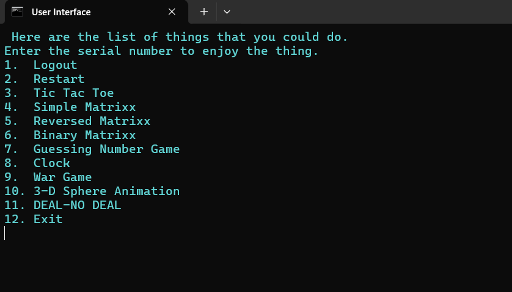

# User Interface Batch Script

This is a Windows batch script named `user_interface.bat`, one of the first programs I wrote in class 9 as I got inclined to computers. It provides a simple user interface with various features and games.

## How to Run

1. Download the `user_interface.bat` file to your computer.
2. Double-click the `user_interface.bat` file to execute it.
3. Follow the on-screen instructions to interact with the script.

## Features

- **User Greeting**: The script greets the user and asks for their name.
- **Menu Options**: Provides a menu with various options such as:
  - Logout
  - Restart
  - Tic Tac Toe
  - Simple Matrix
  - Reversed Matrix
  - Binary Matrix
  - Guessing Number Game
  - Clock
  - War Game
  - 3-D Sphere Animation
  - Deal or No Deal
  - Exit
- **Games and Animations**: Includes several games and animations for entertainment.

## Screenshot

Replace `path/to/screenshot.png` with the actual path to your screenshot file.

---

Feel free to explore the script and enjoy the various features and games it offers!
